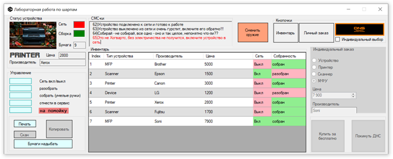

## Лабораторная работа №7 (ООП в языке программирования c# с использованием WinForms)
Приложение имитирует магазин спецтехники (устройство, принтер, сканер, МФУ).
Работа каждого устройства реализована с использованием классов и основных принципов ООП.

